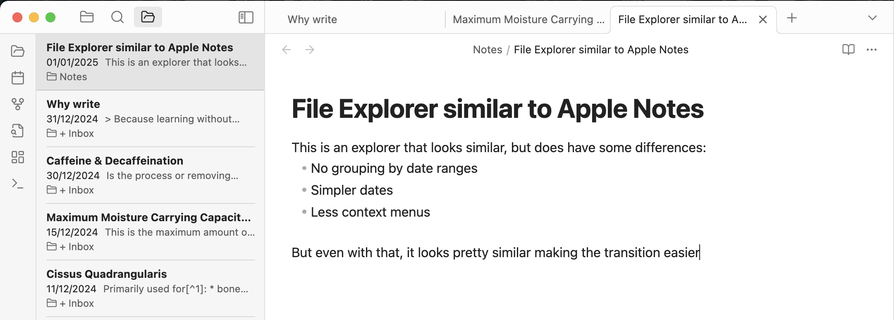

# Obsidian Apple Notes File Explorer

Adds the option of a file explorer that looks similar to Apple Notes one ordered by last modified date.

To open the file explorer, click on the icon in the sidebar.

## Installation via <abbr title="Beta Reviewers Auto-update Tester">BRAT</abbr> (for pre-releases or betas)

1. Install [BRAT](https://github.com/TfTHacker/obsidian42-brat).
2. Add "Mononote" to BRAT:
   1. Open "Obsidian42 - BRAT" via Settings → Community Plugins
   2. Click "Add Beta plugin"
   3. Use the repository address `bumbu/obsidian-apple-notes-file-explorer`
3. Enable "Mononote" under Settings → Options → Community Plugins

## Development

1. Clone the repository (into your Obsidian vault, .obsidian/plugins folder)
2. Run `npm install` to install the dependencies.
3. Run `npm run dev` to compile and have it watch for file changes.

## License

MIT, see [LICENSE.md](LICENSE.md).
